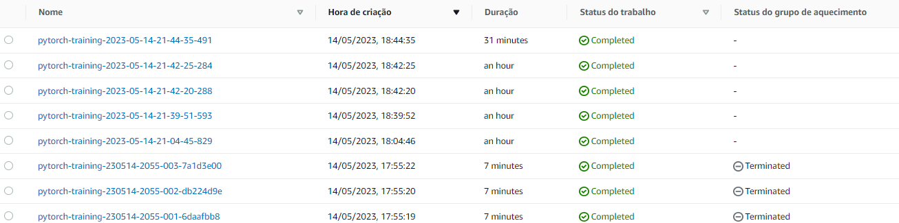
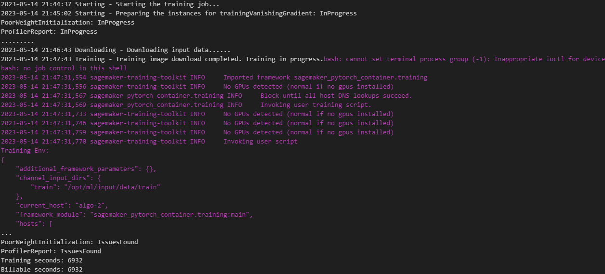
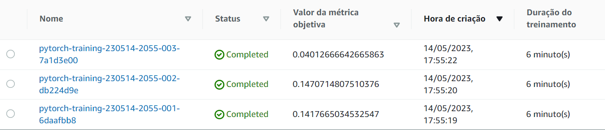
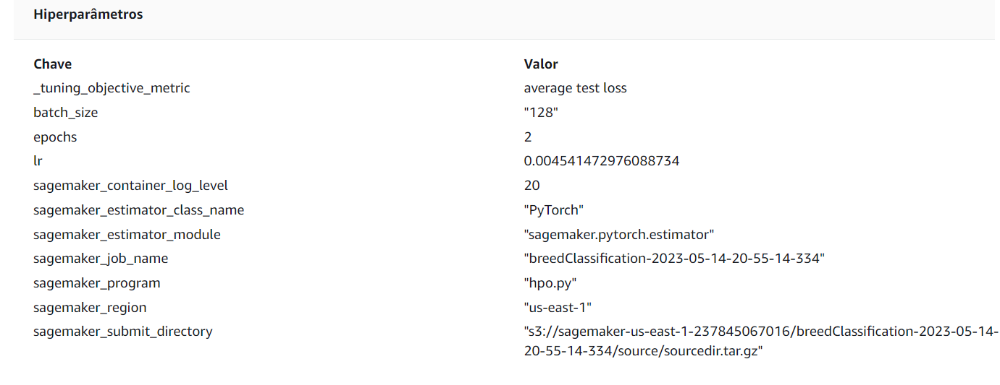
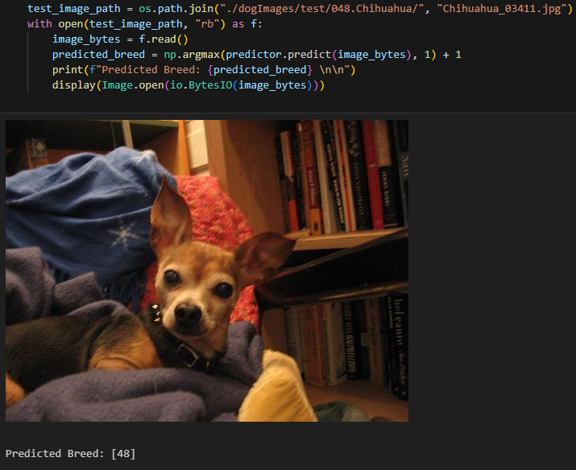

# Image Classification using AWS SageMaker

Use AWS Sagemaker to train a pretrained model that can perform image classification by using the Sagemaker profiling, debugger, hyperparameter tuning and other good ML engineering practices. This can be done on either the provided dog breed classication data set or one of your choice.

## Project Set Up and Installation
Enter AWS through the gateway in the course and open SageMaker Studio. 
Download the starter files.
Download/Make the dataset available. 

## Dataset
The provided dataset is the dogbreed classification dataset which can be found in the classroom.
The project is designed to be dataset independent so if there is a dataset that is more interesting or relevant to your work, you are welcome to use it to complete the project.

### Access
Upload the data to an S3 bucket through the AWS Gateway so that SageMaker has access to the data. 

## Hyperparameter Tuning
### What kind of model did you choose for this experiment and why? 

I chose ResNet50 as a pretrained model to recognize images. One of the main advantages of the model is the capability to perform in diferent datasets and image sizes.

### Give an overview of the types of parameters and their ranges used for the hyperparameter search

It was performed a grid search for the learning rate, varying from 0.001 to 0.1, batch size, with values of 32,64 and 128 and number of epochs, being 2 or 3.

Remember that your README should include:
### A screenshot of completed training jobs

### Logs metrics during the training process

### Tune at least two hyperparameters

### Retrieve the best best hyperparameters from all your training jobs

## Debugging and Profiling Results
### What are the results/insights did you get by profiling/debugging your model?

* The training job started on May 7, 2023, at 16:43:51 and ran for 4088 seconds. During this time, the training loop took 4013 seconds, initialization took 73 seconds, and finalization took 1 second.
* Almost a third of the time were not spend on TRAIN or EVAL, and it sugests I verify what happens beteween those.
* The StepOutlier rule was the most frequently triggered, processing 212 datapoints and triggered 7 times. The MaxInitializationTime rule also triggered, indicating that initialization took too long.

## Model Deployment

once the model is deployed, to make a prediction you just need to read the amage and send it to the model and it retrives the output for every breed. the most likely breed is the one whose output value is the greatest.