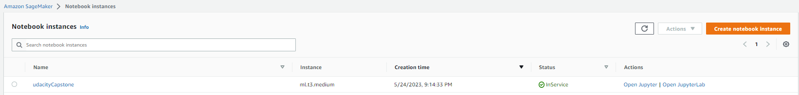
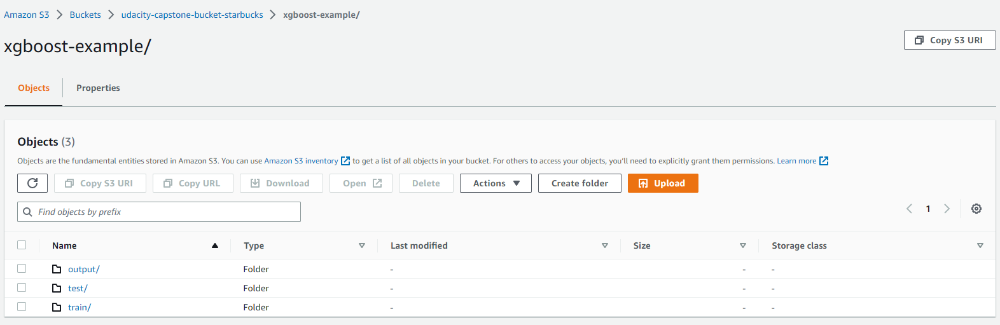
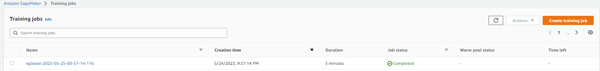
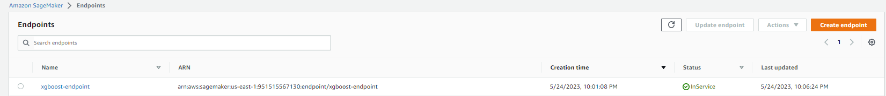

# Starbucks Offer Recommendation System

This project aims to build a recommendation system for Starbucks offers using transaction, demographic, and offer data. The goal is to determine which demographic groups respond best to which offer type. The dataset used in this project is a simplified version of the real Starbucks app data.

## Functionality

The code performs the following steps:

1. Data Gathering and Cleaning:
   - Reads the data files: `portfolio.json`, `profile.json`, and `transcript.json`.
   - Preprocesses the data by handling missing values, renaming columns, converting data types, and performing one-hot encoding.

2. Exploratory Data Analysis:
   - Analyzes the distribution of gender, age, and income in the customer profile dataset.
   - Visualizes the distribution of event types in the transcript dataset.

3. Building Offer Dataset:
   - Combines the transcript, portfolio, and profile datasets to create an offer dataset.
   - Calculates the completion rate for each offer.
   - Filters out incomplete data and unnecessary columns.

4. Model Training and Evaluation:
   - Splits the dataset into training, validation, and test sets.
   - Builds an XGBoost classifier model.
   - Trains the model on the training set.
   - Evaluates the model's performance using accuracy, precision, recall, F1 score, and ROC AUC.
   - Displays a confusion matrix and ROC curve.

5. Feature Importance:
   - Computes and visualizes the importance of features in the XGBoost model.

6. Prediction:
   - Makes predictions using the trained model.
   - Displays the predictions for the entire dataset.

7. Deployment
   - Uses AWS sagemaker to train and deploy

## Screenshots

*Screenshot: AWS Notebook Instance*

*Screenshot: AWS S3 Bucket*

*Screenshot: AWS Training Job*

*Screenshot: AWS Deployed Endpoint*

## Requirements

The code requires the following Python packages:
- `numpy`
- `pandas`
- `matplotlib`
- `seaborn`
- `xgboost`
- `scikit-learn`

Make sure to install the required packages before running the code.

## Usage

1. Download the code files and the dataset files (`portfolio.json`, `profile.json`, `transcript.json`) from the repository.

2. Place the code files and the dataset files in the same directory.

3. Open a terminal or command prompt and navigate to the directory containing the code files and the dataset files.

4. Run the Python code using the command `python code_file.py`, replacing `code_file.py` with the actual name of the code file.

5. The code will execute the functionality described above and display the results in the terminal or command prompt.
